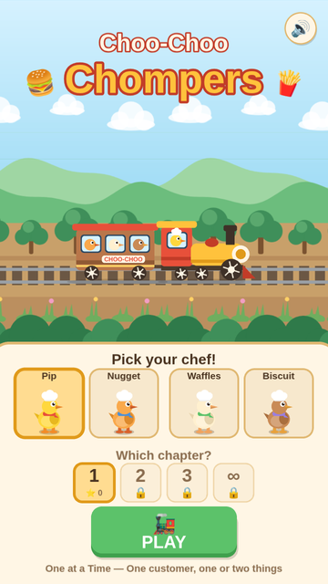
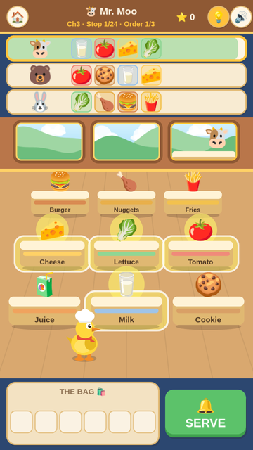
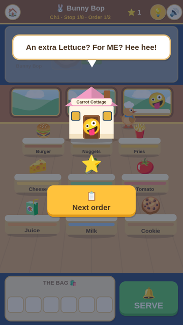

# Choo-Choo Chompers for Omarchy

A gentle, toddler-friendly train-kitchen game, as an Omarchy 4 bar button. The
duckling brothers run a kitchen on rails: tap the stations to fill the bag, hit
**SERVE**, and see how the customer reacts. There's no way to lose, and a wrong
order is a joke, not an error.

The whole game is bundled here and **plays fully offline**.

<p align="center">
  
  
  
</p>

## Install

Run this in a terminal:

```bash
omarchy plugin add https://github.com/AlanRoman117/omarchy-choo-choo-chompers.git --enable
```

A train button appears on the right of the top bar. Click it to play. It's a bar
button, so it won't show up in the app launcher.

If you added the plugin without `--enable`, or the button doesn't appear,
enable it:

```bash
omarchy plugin list                                   # should list it as "enabled"
omarchy plugin enable alanroman.choo-choo-chompers
```

Clicking the button while the game is open brings the open window to the front
rather than opening a second one.

## Update

```bash
omarchy plugin update alanroman.choo-choo-chompers
```

This shows you the full diff before applying anything. Close the game first.

## Wi-Fi

The game never uses the network. Everything it needs is in this folder, and
it keeps working with Wi-Fi off. You never *have* to turn Wi-Fi off. Some good
times to do it anyway:

- **Before handing the computer to a child.** If they get out of the game
  window (see *It's not a kiosk*), there's no internet to wander into.
- **For a long play session.** Chats, updates and email can't pop up
  notifications in the middle of the game.
- **When travelling.** It plays the same with no connection.

Keep Wi-Fi **on** to install or update the plugin, because both download from
GitHub. The usual order: install or update, launch the game, turn Wi-Fi off,
hand it over, and turn Wi-Fi back on afterwards.

To switch Wi-Fi, use the network icon in the bar, or run:

```bash
rfkill block wifi     # off
rfkill unblock wifi   # back on
```

The `rfkill` switch stays set across reboots, so remember to turn Wi-Fi back on.

## What you're running

Omarchy plugins run unsandboxed inside `omarchy-shell`, so here is all of it:

- `BarWidget.qml` (about 25 lines) draws the button and runs `launch.sh`.
- `launch.sh` (a short shell script) opens `game/index.html` with
  `omarchy-launch-webapp`, as a Chromium app window. If the game is already
  open, it focuses that window instead of opening another.
- `game/` is the game itself. It runs inside the browser's sandbox, and
  `game.js` is left unminified so updates show a readable diff.
- `screenshots/` holds only the images on this page; nothing loads them.

Nothing is downloaded or sent anywhere. `game/index.html` also carries a
Content-Security-Policy that blocks all network requests, remote images and
frames, so the page can't reach the internet even with Wi-Fi on.

## It's not a kiosk

The game opens in a browser app window. That window hides the address bar, but
it's still a browser: keyboard shortcuts such as Ctrl+N can open an ordinary
browser window, and Super-key shortcuts can close or move the game. That
browser uses the game's own profile, so it has none of your logins, history or
tabs. But if Wi-Fi is on, it can reach the web. For young children, turn Wi-Fi
off (see below), and stay nearby.

## Saves

The game opens in its own browser profile, at
`~/.local/share/choo-choo-chompers/browser` (or under `$XDG_DATA_HOME`). That
keeps it out of your normal browser session, and keeps saves outside the plugin
folder, so updating or removing the plugin never touches them. Delete that
folder to reset progress.

It's a separate profile, not a lockdown.

## Keybinding

To launch it from the keyboard as well, bind the script in your Hyprland config.
For example, in `~/.config/hypr/bindings.lua`:

```lua
o.bind("SUPER + SHIFT + G", "Choo-Choo Chompers",
  "bash ~/.config/omarchy/plugins/alanroman.choo-choo-chompers/launch.sh")
```

## Remove

```bash
omarchy plugin remove alanroman.choo-choo-chompers
rm -rf ~/.local/share/choo-choo-chompers   # optional: also delete saves
```

To hide the button without uninstalling, run
`omarchy plugin disable alanroman.choo-choo-chompers`.

## A note on terminal commands

Type these commands exactly as shown. Don't put `!` in front: in a normal
terminal `!` reverses whether a command succeeded, which can quietly skip the
command after a `&&`.

## License

MIT. Everything that runs is in this repo: `BarWidget.qml`, `launch.sh`, and
the unminified game in `game/`.
